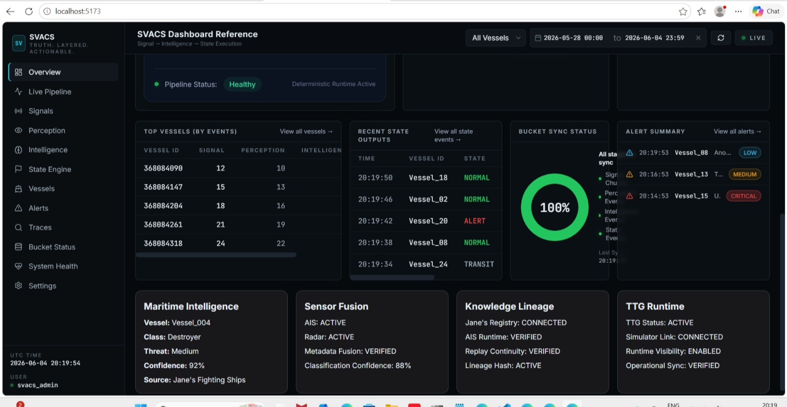
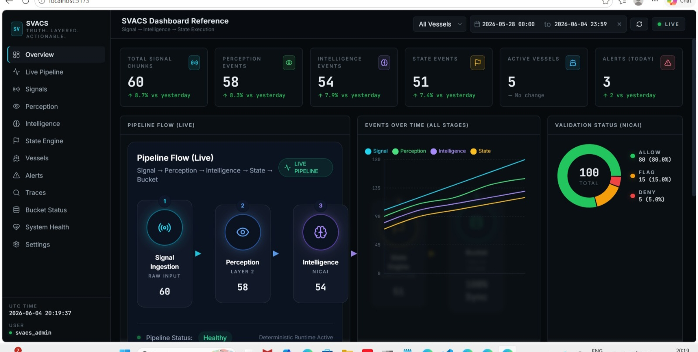
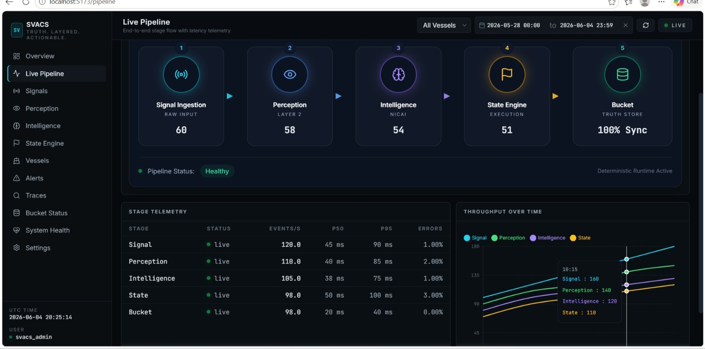
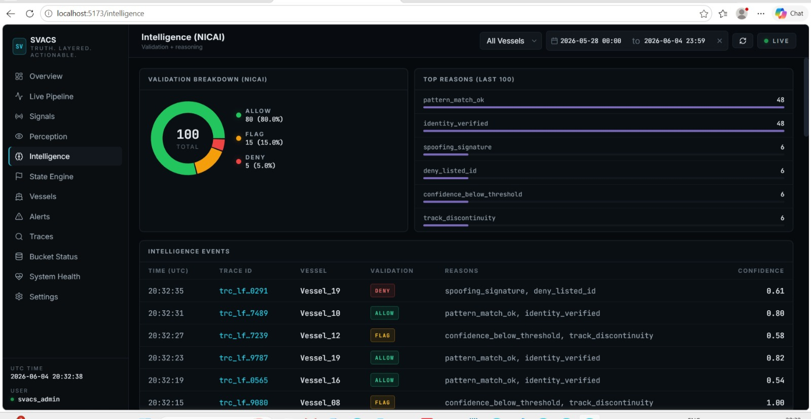
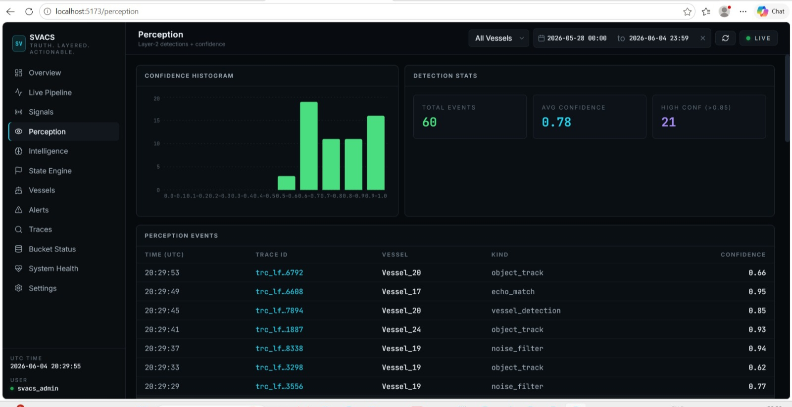
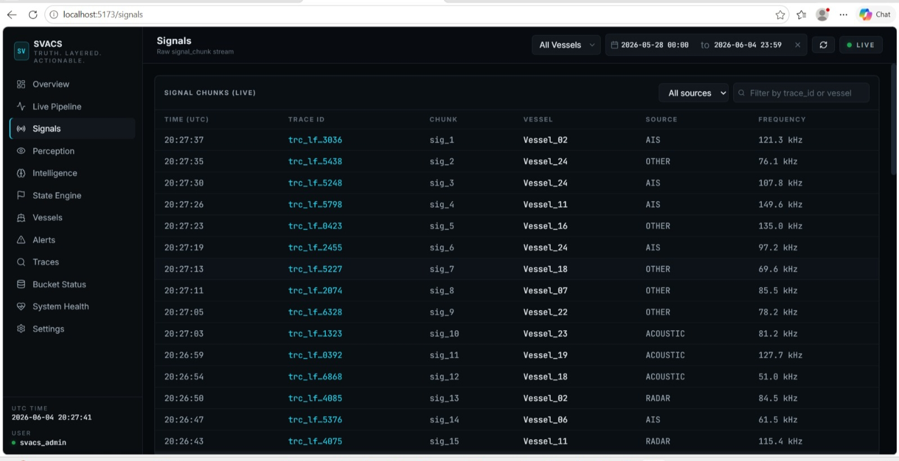
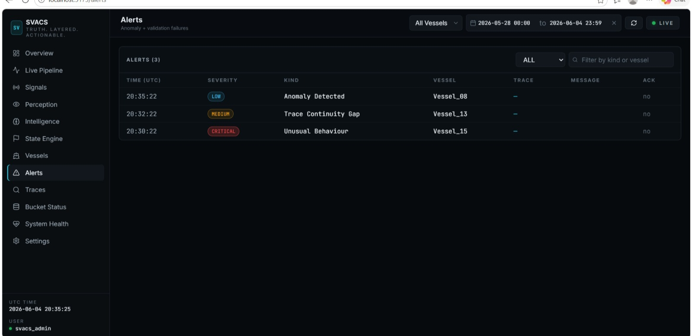

# README.md

# SVACS Unified Core

## Runtime-Grounded Deterministic Maritime Intelligence Execution Substrate

---

# Overview

SVACS Unified Core is a deterministic, replay-safe maritime intelligence execution substrate designed for:

* Maritime telemetry participation
* AIS runtime ingestion
* Jane's maritime knowledge grounding
* Sensor fusion reasoning
* Vessel intelligence classification
* Provenance continuity
* Governance-aware orchestration
* Replay-safe execution
* Append-only lineage persistence
* Operational maritime dashboards

The platform validates deterministic runtime continuity across:

```text
SIGNAL
↓
NOISE
↓
AIS
↓
GEO
↓
JANE'S ENRICHMENT
↓
PERCEPTION
↓
INTELLIGENCE
↓
STATE
↓
BUCKET
↓
REPLAY
↓
OBSERVABILITY
↓
DASHBOARD
```

---

# System Objectives

SVACS validates:

* Deterministic runtime orchestration
* Replay-safe maritime execution
* AIS participation
* Jane's knowledge participation
* Vessel intelligence reasoning
* Sensor fusion classification
* Provenance continuity
* Governance-aware lineage
* Dashboard cognition visibility
* Operator auditability
* Replay-safe reconstruction

---

# Runtime Architecture

```text
SIGNAL
↓
NOISE
↓
AIS
↓
GEO
↓
JANE'S ENRICHMENT
↓
PERCEPTION
↓
INTELLIGENCE
↓
STATE
↓
BUCKET
↓
REPLAY
↓
OBSERVABILITY
↓
DASHBOARD
```

---

# Core Runtime Components

| Component     | Responsibility                    |
| ------------- | --------------------------------- |
| SIGNAL        | Maritime telemetry ingestion      |
| NOISE         | Runtime perturbation handling     |
| AIS           | Vessel telemetry participation    |
| GEO           | Geo-provenance enrichment         |
| JANE'S        | Maritime knowledge enrichment     |
| PERCEPTION    | Vessel interpretation             |
| INTELLIGENCE  | Threat and risk reasoning         |
| STATE         | Deterministic runtime persistence |
| BUCKET        | Append-only lineage persistence   |
| REPLAY        | Deterministic reconstruction      |
| OBSERVABILITY | Runtime visibility                |
| DASHBOARD     | Operational cognition surface     |

---

# Maritime Knowledge Grounding

SVACS supports maritime knowledge grounding through Jane's Fighting Ships derived metadata.

Knowledge ingestion flow:

```text
PDF
↓
Extraction
↓
Structured Knowledge
↓
Provenance Layer
↓
Maritime Knowledge Corpus
↓
SVACS Runtime
```

Artifacts:

```text
external_grounding/janes_ingestion_pipeline.py

janes_provenance_manifest.json

janes_corpus_statistics.json

knowledge_ingestion_validation.json
```

---

# Jane's Runtime Participation

Runtime metadata supports:

* vessel_class
* operational_role
* propulsion_metadata
* size_metadata
* signature_profile
* source_metadata
* lineage_metadata

Artifacts:

```text
external_grounding/janes_ingestion_pipeline.py

runtime/runtime_vessel_metadata_flow.json
```

---

# AIS Runtime Participation

Runtime AIS integration supports:

* Vessel identity traversal
* AIS metadata ingestion
* Provenance linkage
* Replay continuity
* Vessel enrichment

Artifacts:

```text
runtime/runtime_ais_trace.json

runtime/runtime_vessel_metadata_flow.json
```

---

# Maritime Knowledge Corpus

Knowledge corpus supports:

* Vessel classes
* Fleet histories
* Vessel lineage
* Fleet evolution visibility
* Nation fleet references

Artifacts:

```text
maritime_knowledge/fleet_history_registry.json

maritime_knowledge/vessel_lineage_registry.json

docs/fleet_evolution_report.md
```

---

# Sensor Fusion Runtime

Sensor fusion supports:

* AIS observations
* Radar observations
* Acoustic observations
* EO/IR observations
* Vessel dimensions
* Displacement metadata
* Unknown observations

Runtime outputs:

* Candidate matches
* Confidence scores
* Uncertainty scores
* Evidence chains
* Lineage references

Artifacts:

```text
sensor_fusion/sensor_fusion_engine.py

sensor_fusion/uncertainty_engine.py

runtime/sensor_fusion_result.json

runtime/sensor_fusion_runtime.json
```

---

# Supported Vessel Categories

Validated vessel identification examples:

* Cargo Vessel
* Destroyer
* Frigate
* Patrol Vessel
* Submarine
* Support Vessel
* Tanker
* Fishing Vessel
* Speedboat
* Unknown Vessel

Total Examples:

```text
10 Vessel Identification Scenarios
```

---

# Vessel Intelligence Runtime

Runtime vessel intelligence provides:

* Vessel classification
* Explainable reasoning
* Confidence scoring
* Evidence chains
* Source lineage visibility

Artifacts:

```text
vessel_intelligence_engine.py

runtime/runtime_vessel_reasoning.json

runtime/runtime_trace_proof.json
```

Outputs:

```text
Classification
↓
Confidence
↓
Evidence
↓
Source Lineage
```

---

# SVACS + NICAI Convergence

Validated intelligence chain:

```text
Guptchar
↓
Maritime Knowledge
↓
Sensor Fusion
↓
Vessel Intelligence
↓
SVACS Runtime
↓
NICAI Runtime
↓
Dashboard
```

Artifacts:

```text
runtime/intelligence_chain_trace.json
```

---

# Dashboard Capability System

Dashboard architecture supports:

* Operational visibility
* Replay visibility
* AIS visibility
* Vessel intelligence visibility
* Sensor fusion visibility
* Lineage visibility
* Provenance visibility

Dashboard primitives:

* Maritime Intelligence Card
* Sensor Fusion Card
* Knowledge Lineage Card
* Replay Card
* Alert Card
* Vessel Card
* Executive Metric Card

Frontend Stack:

* React
* Vite
* TypeScript
* TailwindCSS

---

# Dashboard Preview

## Operational Overview

### Dashboard Overview



### Dashboard Overview 2



### Runtime Pipeline



---

## Vessel Intelligence Runtime

### Intelligence View



### Perception View



### Signals View



---

## Sensor Fusion & Alerts

### Alerts Panel



---

# Project Structure

```text

svacs_unified_core/
│
├── contracts/
│   └── execution_contract_validator.py
│
├── core/
│   └── core_executor.py
│
├── dashboard/
│
├── dashboard_screenshots/
│   ├── dashboard_overview.jpeg
│   ├── dashboard_overview_2.jpeg
│   ├── pipeline_view.jpeg
│   ├── Intelligence.jpeg
│   ├── Perception_view.jpeg
│   ├── Signals_view.jpeg
│   └── alerts_panel.jpeg
│
├── data/
│
├── docs/
│
├── external_grounding/
│   ├── janes_ingestion_pipeline.py
│   ├── ais_runtime_adapter.py
│   └── runtime_registry_join.py
│
├── geo/
│   └── geo_trace_reconstruction.json
│
├── governance/
│   └── dataset_governance_validator.py
│
├── guptchar_ingestion/
│   └── janes_ingestor.py
│
├── intelligence/
│   └── intelligence_engine.py
│
├── lineage/
│   └── runtime_lineage_report.json
│
├── maritime_knowledge/
│   ├── fleet_history_registry.json
│   └── vessel_lineage_registry.json
│
├── operator/
│   └── human_validation_log.json
│
├── orchestration/
│   └── live_pipeline.py
│
├── perception/
│   └── perception_engine.py
│
├── rajya/
│   └── rajya_validator.py
│
├── replay/
│   └── replay_engine.py
│
├── reports/
│   └── scenario_outputs.json
│
├── rl/
│
├── rl_sandbox/
│   ├── reward_model.py
│   ├── episode_manager.py
│   └── training_logger.py
│
├── runtime/
│   ├── single_trace_runtime.json
│   ├── runtime_trace_proof.json
│   ├── runtime_vessel_reasoning.json
│   ├── runtime_vessel_metadata_flow.json
│   ├── sensor_fusion_result.json
│   ├── sensor_fusion_runtime.json
│   ├── runtime_ais_trace.json
│   └── intelligence_chain_trace.json
│
├── runtime_proof_logs/
│
├── sarathi/
│   └── token_manager.py
│
├── scenario_execution_reports/
│   └── sensor_noise_report.json
│
├── scenario_replay_reports/
│   └── sensor_noise_replay.json
│
├── scenarios/
│   └── scenario_runner.py
│
├── sensor_fusion/
│   ├── sensor_fusion_engine.py
│   └── uncertainty_engine.py
│
├── shared/
│   └── schemas/
│       └── provenance_registry.json
│
├── signal_events/
│   └── signal_generator.py
│
├── state/
│   └── state_engine.py
│
├── storage/
│   ├── logs/
│   │   └── full_runtime_chain_log.jsonl
│   └── rl_runtime_proof.json
│
├── stress/
│   └── entropy_survival_report.md
│
├── telemetry/
│   └── telemetry_manager.py
│
├── tests/
│   └── federated_replay_validation.py
│
├── ttg/
│
├── utils/
│   └── append_only_utils.py
│
├── validation_reports/
│
├── full_operational_chain.py
├── vessel_intelligence_engine.py
├── main.py
├── requirements.txt
│
├── README.md
├── REVIEW_PACKET.md
├── TESTING_PACKET.md
├── TEAM_CONVERGENCE_REPORT.md
├── frontend_integration_report.md
├── operational_dashboard_layout.md
├── dashboard_capability_report.md
├── component_library.md
│
├── janes_runtime_registry.json
├── janes_registry_runtime.json
├── janes_aligned_registry.json
├── runtime_vessel_metadata.json
├── source_lineage_report.json
├── single_trace_full_proof.json
└── healthcheck_report.json
```

---

# Installation

## Create Virtual Environment

```bash
python -m venv .venv
```

## Activate Environment

Windows:

```bash
.venv\Scripts\activate
```

Linux / Mac:

```bash
source .venv/bin/activate
```

## Install Dependencies

```bash
pip install -r requirements.txt
```

---

# Execution Commands

Run Operational Chain:

```bash
python full_operational_chain.py
```

Run Jane's Ingestion:

```bash
python external_grounding/janes_ingestion_pipeline.py
```

Run Sensor Fusion:

```bash
python sensor_fusion/sensor_fusion_engine.py
```

Run Uncertainty Analysis:

```bash
python sensor_fusion/uncertainty_engine.py
```

Run Vessel Intelligence:

```bash
python vessel_intelligence_engine.py
```

---

# Runtime Validation

Successful execution validates:

```text
SIGNAL -> COMPLETED
GEO -> COMPLETED
PERCEPTION -> COMPLETED
INTELLIGENCE -> COMPLETED
STATE -> COMPLETED
BUCKET -> COMPLETED
REPLAY -> COMPLETED
OBSERVABILITY -> COMPLETED
DASHBOARD -> COMPLETED
```

Validated guarantees:

```text
DETERMINISTIC_CHAIN_VERIFIED

REPLAY_SAFE

LINEAGE_CONTINUITY_VERIFIED

APPEND_ONLY_VALIDATED
```

---

# Team Convergence

| Contributor | Responsibility                                                  |
| ----------- | --------------------------------------------------------------- |
| Ankita      | Runtime convergence, vessel intelligence, governance continuity |
| Nupur       | Jane's integration, AIS participation, provenance continuity    |
| Raj         | State runtime participation, deterministic closure              |
| Nikhil      | Dashboard cognition architecture                                |
| Bucket Team | Replay persistence and lineage continuity                       |

---

# Final System Characteristics

SVACS Unified Core is:

* Runtime-grounded
* Deterministic
* Replay-safe
* Governance-aware
* Provenance-visible
* Append-only
* Mutation-resistant
* AIS-participating
* Lineage-preserving
* Sensor-fusion-capable
* Explainable
* Operationally traceable

---

# Final Validation Status

```text
SYSTEM STATUS: OPERATIONAL
RUNTIME STATUS: VERIFIED
AIS STATUS: VERIFIED
JANE'S STATUS: VERIFIED
MARITIME KNOWLEDGE STATUS: VERIFIED
SENSOR FUSION STATUS: VERIFIED
VESSEL INTELLIGENCE STATUS: VERIFIED
NICAI CONVERGENCE STATUS: VERIFIED
REPLAY STATUS: VERIFIED
LINEAGE STATUS: VERIFIED
BUCKET STATUS: VERIFIED
DASHBOARD STATUS: ACTIVE
```
